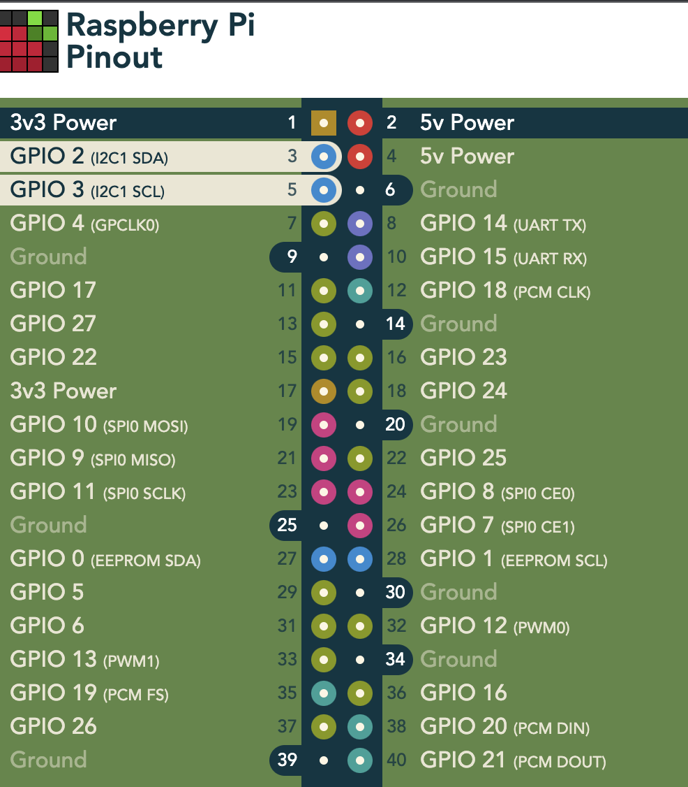
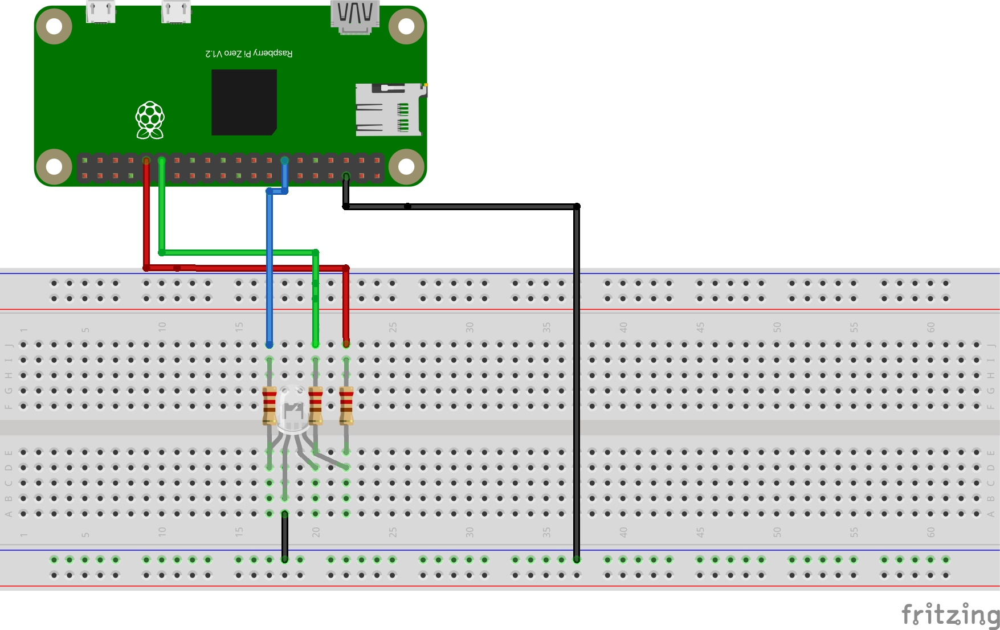
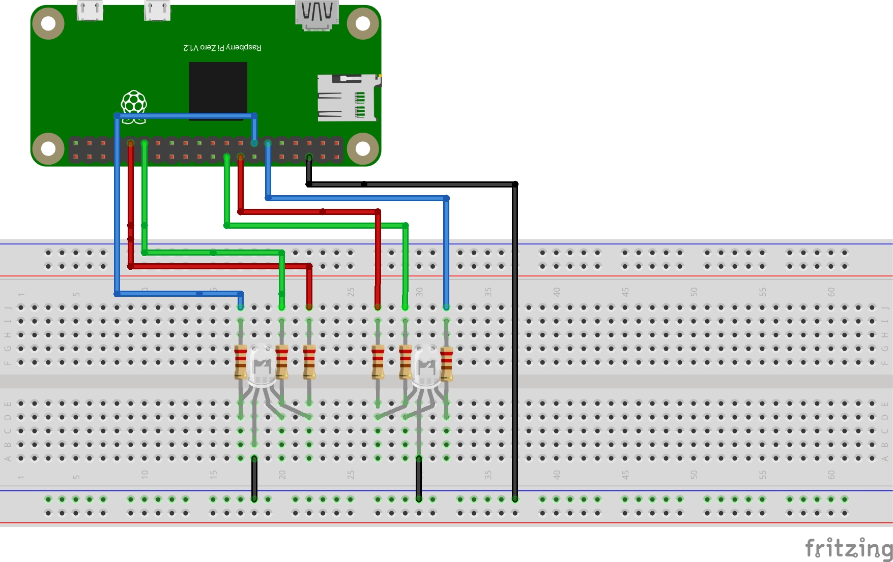
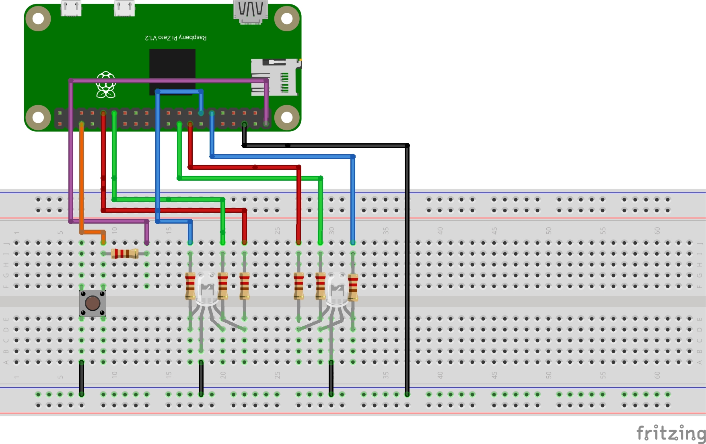

# Setting Up an RGB Circuit with custom device tree overlay for use with Delux

## Introduction

### Goals

- Set up a circuit with two RGB LEDs
- Add a button
- Set the GPIOs to the LEDs
- Control the LEDs using the button and Delux

### Required Materials

- Raspberry Pi Zero
- Two RGB LEDs
- Breadboard
- Six 220 ohm resistors
- One 10k ohm resistor
- One Pushbutton
- Jumper cables

### Part 1: Basic Setup and Single RGB LED Control

#### Setting Up the Development Environment

More info pertaining to Nerves can be found in the [Nerves documentation](https://hexdocs.pm/nerves/installation.html). The Delux documentation can be found [here](https://hexdocs.pm/delux/readme.html).

Install Elixir and Nerves.

To begin, create a basic nerves project and install on your `rpi0`.
I like to set the MIX_TARGET so I don't need to specify the target for all my cmds.

Create a new Nerves project.

``` code
mix nerves.new delux_demo
cd delux_demo
export MIX_TARGET=rpi0
mix deps.get
```

#### Set up Delux and the Indicators

TODO: come back and add Delux Helper here

To start, decide how you'll name your LEDs. I've used a simple naming convention of `rgb-color0` and `rgb-color1`.

- Add Delux to `mix.exs`
- Set LED names as indicators in the Application Supervisor like so and configure the rest of the Application Supervisor.

``` elixir
 indicators = %{
      default: %{green: "rgb-green0", blue: "rgb-blue0", red: "rgb-red0"}
    }

    children =
      [
        {Delux, name: Delux, indicators: indicators} ]

  opts = [strategy: :one_for_one, name: DeluxDemo.Supervisor]
  Supervisor.start_link(children, opts)
```

#### Building the First RGB LED Circuit



Using the pinout diagram, build a circuit for the first RGB LED using the 220 ohm resistors. Make note of each GPIO pin used as they will be referenced later.



I've used GPIOs 16, 20, and 21 for red, green, and blue.
Make note of the GPIOs used for each leg of the RGB.

#### Setting the LEDs to GPIO with a pre-existing Device Tree Overlay

- Load the device tree blob object - `gpio-led.dtbo` - to your Raspberry Pi
  - Can be found within nerves artifacts with `find ~/.nerves/artifacts -name "*gpio-led*"`
  - SCP that to your Nerves device.

#### Interacting with the LED in IEx

Set the legs of the LED to your GPIOs using the following cmd. Make sure to label each one accurately as we will be adding more to the circuit.

  ``` elixir
  cmd("dtoverlay /data/gpio-led.dtbo label=rgb-red0 gpio=16")
  cmd("dtoverlay /data/gpio-led.dtbo label=rgb-green0 gpio=20")
  cmd("dtoverlay /data/gpio-led.dtbo label=rgb-blue0 gpio=21")
  ```

At this point, you can test the LEDs using our Delux settings in the Application Supervisor but will need to manually start the Application to get it running with the new GPIOs. You can substitute other colors for `:red` to control the colors. See the Delux Documentation for other effects.

``` elixir
  DeluxDemo.Application.start(:normal, [])
  Delux.render(%{default: Delux.Effects.on(:red)})
```

### Part 2: Add a Second LED and set the GPIOs



Build the circuit for the second LED.

Add the next set of indicators to the Application Supervisor

``` elixir
indicators = %{
      default: %{green: "rgb-green0", blue: "rgb-blue0", red: "rgb-red0"}
      rgb: %{green: "rgb-green1", blue: "rgb-blue1", red: "rgb-red1"}
    }
```

and build the firmware again.
`mix firmware`
`mix build`

Add this LED to the device tree overlay using the pins and new labels (we'll also need to add the other ones back as this does not persist between boots).

``` elixir
  cmd("dtoverlay /data/gpio-led.dtbo label=rgb-red0 gpio=16")
  cmd("dtoverlay /data/gpio-led.dtbo label=rgb-green0 gpio=20")
  cmd("dtoverlay /data/gpio-led.dtbo label=rgb-blue0 gpio=21")

  cmd("dtoverlay /data/gpio-led.dtbo label=rgb-red1 gpio=23")
  cmd("dtoverlay /data/gpio-led.dtbo label=rgb-green1 gpio=24")
  cmd("dtoverlay /data/gpio-led.dtbo label=rgb-blue1 gpio=25")
```

You can control this LED as demonstrated above and can control both like so

`Delux.render(%{default: Delux.Effects.on(:magenta), rgb: Delux.Effects.on(:magenta)})`

#### Introducing a Push-Button

Add a push-button to the circuit with a pull-up resistor as shown in the diagram.


#### Setting Up GenServers

- Explain the role of GenServers in managing state and processes.
Now, we'll use two GenServers for sending the button presses to the LEDs.

Add each GenServer to the child processes in your Application Supervisor.
Create each GenServer. I called mined `Blink` and `Button`.

#### Blink GenServer

See `blink.ex` for a simple GenServer that receives messages from the `Button` GenServer and renders patterns based on how many button presses occur.
Feel free to change colors, patterns, or slots - note the default slots have a prioritization order and can be overridden by others.

##### Button GenServer

See `button.ex` for the other GenServer. We set up our input pin and monitor it with `Circuits.GPIO` and send the button presses to the `Blink` GenServer.

### Part 3: Bringing It All Together

Build the firmware again and upload it the device. Set all the GPIOs with the dtoverlay cmd again and start the Delux Process.

``` elixir
  cmd("dtoverlay /data/gpio-led.dtbo label=rgb-red0 gpio=6")
  cmd("dtoverlay /data/gpio-led.dtbo label=rgb-green0 gpio=5")
  cmd("dtoverlay /data/gpio-led.dtbo label=rgb-blue0 gpio=26")

  cmd("dtoverlay /data/gpio-led.dtbo label=rgb-red1 gpio=23")
  cmd("dtoverlay /data/gpio-led.dtbo label=rgb-green1 gpio=24")
  cmd("dtoverlay /data/gpio-led.dtbo label=rgb-blue1 gpio=27")
```

and voila! You are now controlling LEDs using Delux and your input button.
TODO: add Delux helper and info about starting button and blink from Application Supervisor and applying dtoverlays there too.

### Conclusion

Feel free to play with slots in the `Blink` GenServer code to see how they override each other or play with additional `Delux.Effects` in the GenServer. There are many combinations. You can also add additional LEDs to indicators or set up custom slots.
