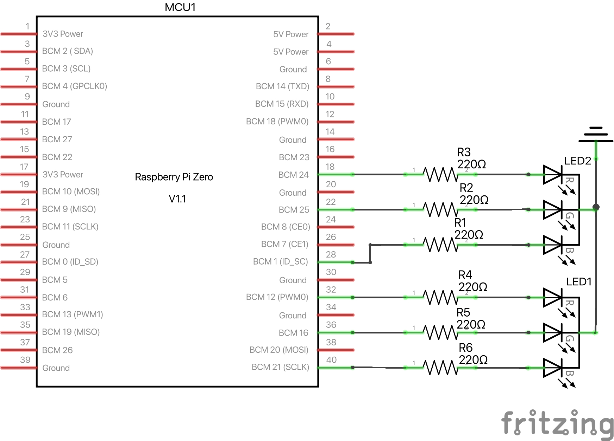

# Setting Up an RGB Circuit with custom device tree overlay for use with Delux

## Introduction

### Goals

- Set up a circuit with two RGB LEDs
- Add a button
- Set the GPIOs to the LEDs
- Control the LEDs using the button and Delux

### Required Materials

- Raspberry Pi Zero
- Two RGB LEDs
- Breadboard
- Six 220 ohm resistors
- One 10k ohm resistor
- One Pushbutton
- Jumper cables

### Part 1: Basic Setup and Single RGB LED Control

#### Setting Up the Development Environment

More info pertaining to Nerves can be found in the [Nerves documentation](https://hexdocs.pm/nerves/installation.html). The Delux documentation can be found [here](https://hexdocs.pm/delux/readme.html).

Install Elixir and Nerves.

To begin, create a basic nerves project and install on your `rpi0`.
I like to set the MIX_TARGET so I don't need to specify the target for all my cmds.

Create a new Nerves project.

``` code
mix nerves.new delux_demo
cd delux_demo
export MIX_TARGET=rpi0
mix deps.get
```

#### Set up Delux

<!-- To start, decide how you'll name your LEDs. I've used a simple naming convention of `rgb-color0` and `rgb-color1`. -->

- Add Delux to `mix.exs` and install dependencies.
<!-- - Set LED names as indicators in the Application Supervisor like so and configure the rest of the Application Supervisor.

``` elixir
 indicators = %{
      default: %{green: "rgb-green0", blue: "rgb-blue0", red: "rgb-red0"}
    }

    children =
      [
        {Delux, name: Delux, indicators: indicators} ]

  opts = [strategy: :one_for_one, name: DeluxDemo.Supervisor]
  Supervisor.start_link(children, opts)
``` -->

### Building the First RGB LED Circuit


Using the pinout diagram, build a circuit for the first RGB LED using the 220 ohm resistors. Make note of each GPIO pin used as they will be referenced later.

 

I've used GPIOs 12, 16, and 21 for red, green, and blue.

### Setting the LEDs to GPIO with a pre-existing Device Tree Overlay

- Load the device tree blob object - `gpio-led.dtbo` - to your Raspberry Pi
  - Can be found within nerves artifacts with `find ~/.nerves/artifacts -name "*gpio-led*"`
  - SCP that to your Nerves device.

#### Interacting with the LED in IEx

Set the legs of the LED to your GPIOs using the following cmd in an iEX session on your nerves device. Make sure to label each one accurately as we will be adding more to the circuit.

  ``` elixir
  cmd("dtoverlay /data/gpio-led.dtbo label=rgb-red0 gpio=12")
  cmd("dtoverlay /data/gpio-led.dtbo label=rgb-green0 gpio=16")
  cmd("dtoverlay /data/gpio-led.dtbo label=rgb-blue0 gpio=21")
  ```

At this point, you can test the LEDs by setting the above labels as indicators in Delux. You can substitute other colors for `:red` to control the colors. See the Delux Documentation for other effects.

``` elixir
 indicators = %{
      default: %{green: "rgb-green0", blue: "rgb-blue0", red: "rgb-red0"}
    }

  DeluxDemo.Application.start(:normal, indicators: indicators)
  Delux.render(%{default: Delux.Effects.on(:red)})
```

### Part 2: Add a Second LED and set the GPIOs




Build the circuit for the second LED.

<!-- Add the next set of indicators to the Application Supervisor -->

You can now control both sets of indicators in your iEX shell on your device.

``` elixir
  cmd("dtoverlay /data/gpio-led.dtbo label=rgb-red0 gpio=12")
  cmd("dtoverlay /data/gpio-led.dtbo label=rgb-green0 gpio=16")
  cmd("dtoverlay /data/gpio-led.dtbo label=rgb-blue0 gpio=21")

  cmd("dtoverlay /data/gpio-led.dtbo label=rgb-red1 gpio=24")
  cmd("dtoverlay /data/gpio-led.dtbo label=rgb-green1 gpio=25")
  cmd("dtoverlay /data/gpio-led.dtbo label=rgb-blue1 gpio=1")

indicators = %{
      default: %{green: "rgb-green0", blue: "rgb-blue0", red: "rgb-red0"}
      rgb: %{green: "rgb-green1", blue: "rgb-blue1", red: "rgb-red1"}
    }

DeluxDemo.Application.start(:normal, indicators: indicators)
Delux.render(%{default: Delux.Effects.on(:magenta), rgb: Delux.Effects.on(:magenta)})
```

<!-- and build the firmware again.
`mix firmware`
`mix build` -->

<!-- Add this LED to the device tree overlay using the pins and new labels (we'll also need to add the other ones back as this does not persist between boots). -->

### Introducing a Push-Button

Add a push-button to the circuit with a pull-up resistor as shown in the diagram and schematic below.


#### Setting Up GenServers

Now, we'll use two GenServers for sending the button presses to the LEDs. We will also set up Delux to run with the indicators set up on start.

Add each GenServer to the child processes in your Application Supervisor.

``` elixir
 indicators = %{
      default: %{green: "rgb-green0", blue: "rgb-blue0", red: "rgb-red0"},
      rgb: %{green: "rgb-green1", blue: "rgb-blue1", red: "rgb-red1"}
    }

    children =
      [
        {Delux, name: Delux, indicators: indicators},
        {DeluxDemo.Blink, []},
        {DeluxDemo.Button, []}
      ]

    opts = [strategy: :one_for_one, name: DeluxDemo.Supervisor]
    Supervisor.start_link(children, opts)
```

Create each GenServer. I called mine `Blink` and `Button`.

To avoid having to add my LEDs each time, I've also added a function to my Application Supervisor that sets them up for me on start.

``` elixir
  defp setup_device_tree_overlays do
    overlays = [
      ["/data/gpio-led.dtbo", "label=rgb-red0", "gpio=12"],
      ["/data/gpio-led.dtbo", "label=rgb-green0", "gpio=16"],
      ["/data/gpio-led.dtbo", "label=rgb-blue0", "gpio=21"],
      ["/data/gpio-led.dtbo", "label=rgb-red1", "gpio=24"],
      ["/data/gpio-led.dtbo", "label=rgb-green1", "gpio=25"],
      ["/data/gpio-led.dtbo", "label=rgb-blue1", "gpio=1"]
    ]

    Enum.each(overlays, fn args ->
      {output, exit_code} = System.cmd("dtoverlay", args)

      if exit_code != 0 do
        Logger.error("Failed to execute: #{Enum.join(args, " ")}")
        Logger.error("Output: #{output}")
      end
    end)
  end
```

The Delux process will crash if it has set indicators that cannot be found under `/sys/class/leds`. Setting these up before the process starts prevents the crash and saves us some extra work.

#### Blink GenServer

See `blink.ex` for a simple GenServer that receives messages from the `Button` GenServer and renders patterns based on how many button presses occur.
Feel free to change colors, patterns, or slots - note the default slots have a prioritization order and can be overridden by others.

##### Button GenServer

See `button.ex` for the other GenServer. We set up our input pin and monitor it with `Circuits.GPIO` and send the button presses to the `Blink` GenServer.

### Part 3: Bringing It All Together

Build the firmware again and upload it the device.
And there you have it.  You are now controlling LEDs using Delux and your input button.

### Conclusion

Feel free to play with slots in the `Blink` GenServer code to see how they override each other or play with additional `Delux.Effects` in the GenServer. There are many combinations. You can also add additional LEDs to indicators or set up custom slots.
